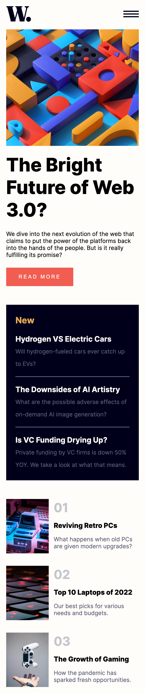
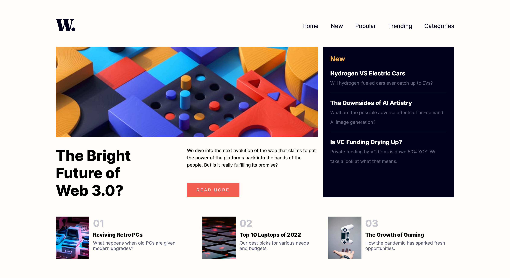

# Frontend Mentor - News homepage solution

This is a solution to the [News homepage challenge on Frontend Mentor](https://www.frontendmentor.io/challenges/news-homepage-H6SWTa1MFl). Frontend Mentor challenges help you improve your coding skills by building realistic projects. 

## Table of contents

- [Overview](#overview)
  - [The challenge](#the-challenge)
  - [Screenshot](#screenshot)
  - [Links](#links)
- [My process](#my-process)
  - [Built with](#built-with)
  - [What I learned](#what-i-learned)
  - [Continued development](#continued-development)
  - [Useful resources](#useful-resources)
- [Author](#author)
- [Acknowledgments](#acknowledgments)

**Note: Delete this note and update the table of contents based on what sections you keep.**

## Overview

### The challenge

Users should be able to:

- View the optimal layout for the interface depending on their device's screen size
- See hover and focus states for all interactive elements on the page

### Screenshot

 

### Links

- Solution URL: [Github](https://github.com/kaecodes/news-homepage.git)
- Live Site URL: [Live URL](https://kaecodes.github.io/news-homepage/)

## My process

### Built with

- Semantic HTML5 markup
- CSS custom properties
- Flexbox
- CSS Grid
- Mobile-first workflow

### What I learned

I learned that it is important to have a solid layout for your HTML file in order to make styling easier. 

### Continued development

I would like to continue to focus on practicing my skills in building a solid HTML layout, styling using Flexbox and CSS, and building functionalities using JS. 

## Author

- LinkedIn - [My LinkedIn](https://linkedin.com/in/kdtnguyen)
- Frontend Mentor - [@kaecodes](https://www.frontendmentor.io/profile/yourusername)

